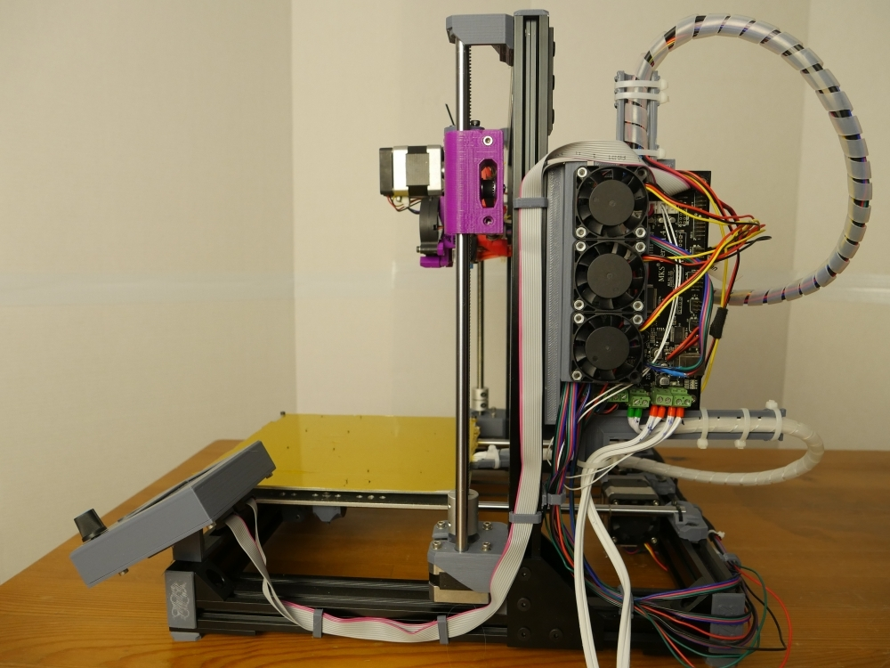

==================================================
Common board adapters for 2040 aluminium extrusion
==================================================

This is a list of adapters I've created that provide board mounts with cooling using 40mm fans and  and wire management for heated bed and extruder in 3D printer frames using 2040 aluminium extrusions.

I designed this for bear upgrade specifically, but it should work with any design.

Proven designs
==============

* `MKS GEN 1.4 <mks_gen_1.4/README.rst>`_

Work in progress
================

* * `BTT SKR 1.4 Turbo <skr_1.4_turbo/README.rst>`_