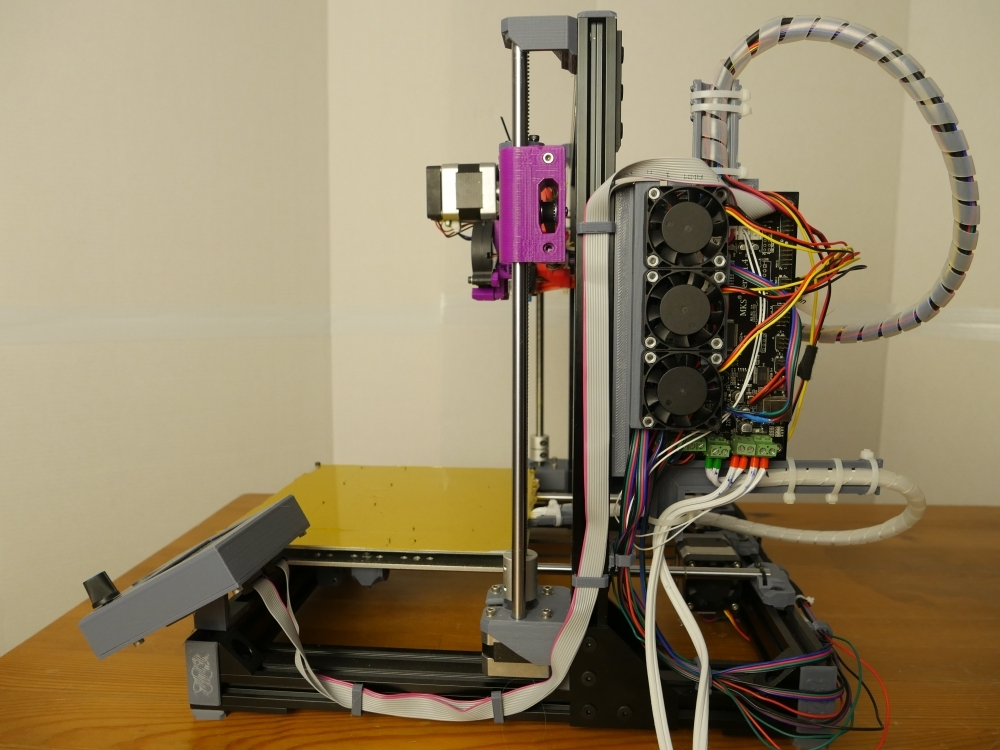

Overview
========

This mount adapts MKS GEN 1.4 to 2040 aluminum extrusion. I built this with Bear Upgrade in mind, but it should also mount anywhere. This mount also provides means of attaching two 5x7cm daughter boards at the back, cable management for the extruder, heated bed and misc wiring at the bottom, it supports a fan bank with up to 3x 40mm fans.

Images
======

BOM
===

Mounting to 2040 frame
----------------------

* 2x M5 10mmm capscrew (4x optional)
* 2x M5 T-nut (4x optional)

Mounting MKS GEN
----------------

* 4x M3 10mm capscrew
* 4x M3 nut

Mounting Daughter board
-----------------------

For each board:

* 4x M3 10mm capscrew
* 4x M3 nut
* 4x m3_peg printed part

Extruder wire management
------------------------

* 2x M3 10mm capscrew
* 2x M3 nut

Heated bed wire management
------------------------

* 2x M3 10mm capscrew
* 2x M3 nut

Fan bank (with 3 fans)
----------------------

Attaching the bank to the main body:

* 3x M3 10mm capscrew
* 3x M3 nut

Mounting fans to the bracket:

* 10x M3 12mm capscrew (moun)
* 10x M3 nut

License
=======

License: Attribution-ShareAlike 4.0 International (CC BY-SA)

https://creativecommons.org/licenses/by-sa/4.0/

Project URLs
============

https://github.com/avolkov/2040-mount/tree/master/mks_gen_1.4

TODO: Add prusaprints url

